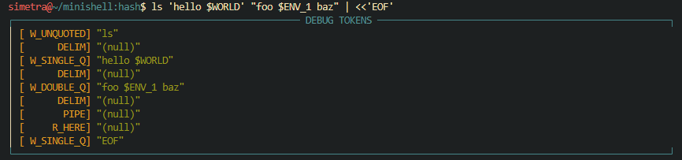

# MINISHELL

## Allowed Functions

**Readline:** `readline`, `rl_clear_history`, `rl_on_new_line`, `rl_replace_line`, `rl_redisplay`, `add_history`

**Forks:** `fork`, `wait`, `waitpid`, `wait3`, `wait4`

**File Descriptors:** `write`, `access`, `open`, `read`, `close`, `stat`, `lstat`, `fstat`, `unlink`, `dup`, `dup2`, `pipe`, `getcwd`, `chdir`

**Signals:** `signal`, `sigaction`, `sigemptyset`, `sigaddset`, `kill`

**Memory:** `malloc`, `free`

**tty:** `isatty`, `ttyname`, `ttyslot`, `ioctl`, `tcsetattr`, `tcgetattr`

**Directory:** `opendir`, `readdir`, `closedir`

**Error:** `perror`, `strerror`

**Termcap:** `tgetent`, `tgetflag`, `tgetnum`, `tgetstr`, `tgoto`, `tputs`

**Other:** `getenv`, `exit`, `execve`, `printf`

## The Role of the Lexical Analyzer
As the first phase of a compiler, the main task of the lexical analyzer is to
read the input characters of the source program, group them into lexemes, and
produce as output a sequence of tokens for each lexeme in the source program.
The stream of tokens is sent to the parser for syntax analysis

**lexeme :** A sequence of input characters that comprises a single token is called a lexeme

---

Sometimes, lexical analyzers are divided into a cascade of two processes:

1. **Scanning:**
	 Handles simple processes that do not require tokenization, such as:
	 - Deletion of comments
	 - Compaction of consecutive whitespace characters into one

2. **Lexical analysis proper:**
	The more complex portion, where the scanner produces the sequence of tokens as output.

### Tokens, Patterns, and Lexemes

- A **token** is a pair consisting of a token name and an optional attribute
value. The token name is an abstract symbol representing a kind of
lexical unit, e.g., a particular keyword, or a sequence of input characters
denoting an identifier. The token names are the input symbols that the
parser processes.
- A **pattern** is a description of the form that the lexemes of a token may take.
In the case of a keyword as a token, the pattern is just the sequence of
characters that form the keyword. For identifiers and some other tokens,
the pattern is a more complex structure that is matched by many strings.
- A **lexeme** is a sequence of characters in the source program that matches
the pattern for a token and is identified by the lexical analyzer as an
instance of that token.

### Lexer Token Definitions

The following table summarizes the tokens produced by our shell lexer, with informal descriptions and example lexemes:

| **Token**     | **Informal Description**                                             | **Sample Lexemes**                |
|---------------|----------------------------------------------------------------------|-----------------------------------|
| `W_UNQUOTED`  | Unquoted, non-whitespace word segments (stops at variable start, metachars)                               | `ls`, `echo`, , `$ENV` `file.txt`          |
| `W_SINGLE_Q`  | String literal surrounded by `'`                                        | `'hello world'`, `'$HOME'`        |
| `W_DOUBLE_Q`  | String literal surrounded by `"` | `"foo $BAR baz"`, `"$date"`     |
| `PIPE`        | Pipeline operator                                                    |                               |
| `R_IN`        | Input redirection operator                                           | `<`                               |
| `R_OUT`       | Output (overwrite) redirection operator                              | `>`                               |
| `R_APPEND`    | Output (append) redirection operator                                 | `>>`                              |
| `R_HERE`      | Here-document redirection operator                                   | `<<`                       |
| `DELIM`       | Delimiter (whitespace)                                               | (space), `\t`, `\n`               |

### Attributes for Tokens

> “In many cases, the lexical analyzer returns to the parser not only a token
> name but also an attribute value that describes the lexeme represented by the
> token; the token name influences parsing decisions, while the attribute value
> influences the execution phase after parsing.”
---

---

